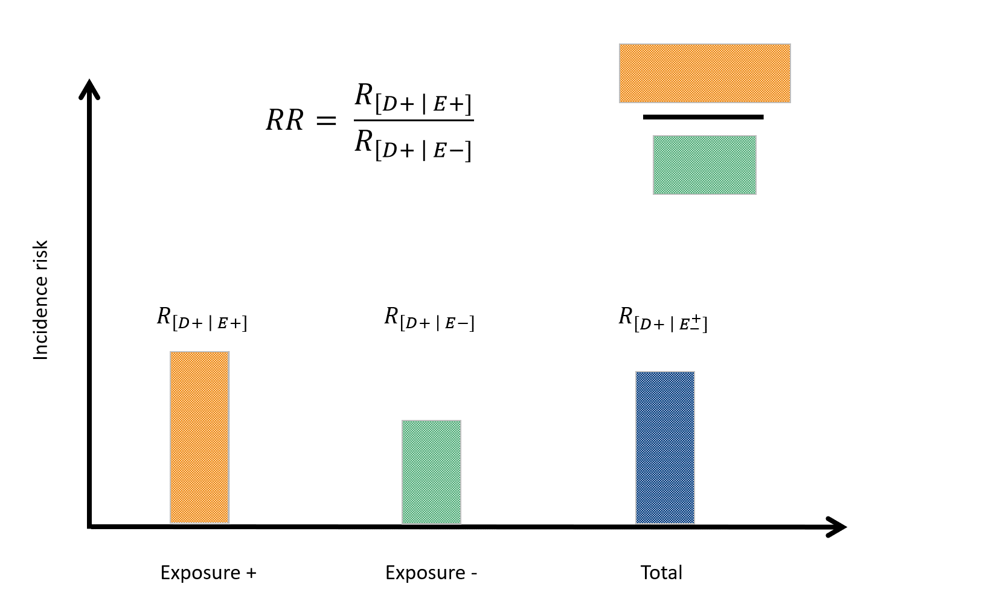
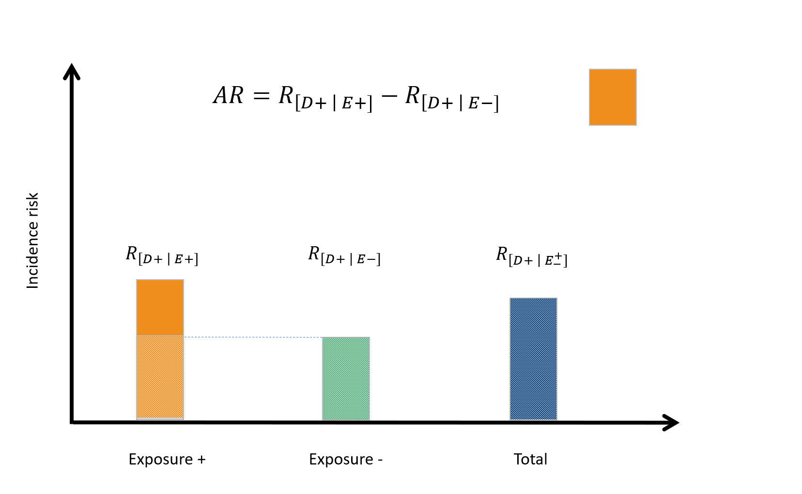
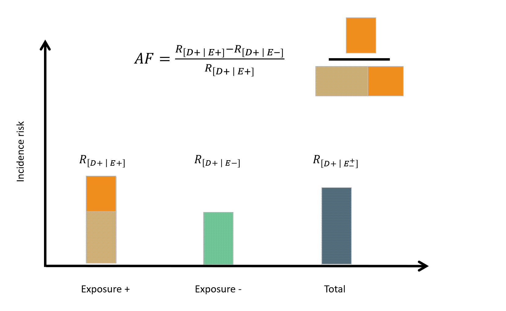
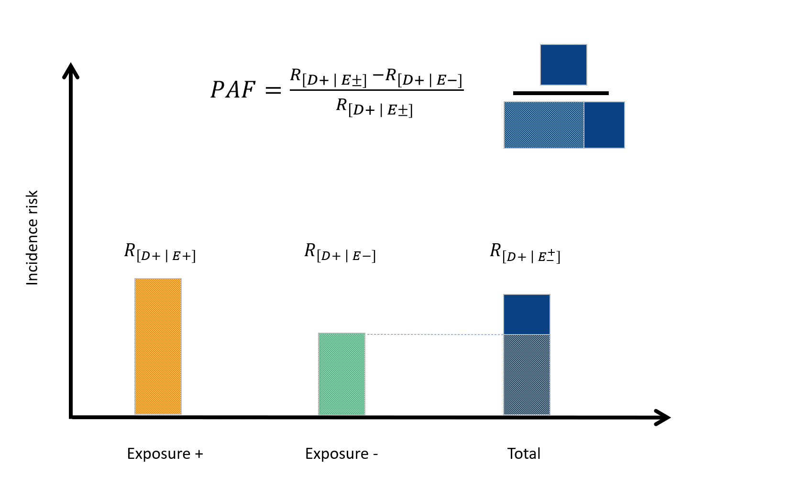

\setmainfont{Calibri Light}

```{r, echo = FALSE, message = FALSE}
library(knitr); library(kableExtra)
knitr::opts_chunk$set(collapse = TRUE, comment = "#>")
options(tibble.print_min = 4L, tibble.print_max = 4L)
```

A common task in epidemiology is to quantify the strength of association between exposures ('risk factors') and disease outcomes. In this context the term 'exposure' is taken to mean a variable whose association with the outcome is to be estimated. 

Exposures can be harmful, beneficial or both harmful and beneficial (e.g. if an immunisable disease is circulating, exposure to immunising agents helps most recipients but may harm those who experience adverse reactions). The term 'outcome' is used to describe all the possible results that may arise from exposure to a causal factor or from preventive or therapeutic interventions [@porta_et_al:2008]. In human and animal health an 'outcome-positive' individual is an individual who has experienced a given disease of interest. 

In this vignette we outline describe how `epiR` can be used to compute the various measures of association used in epidemiology notably the risk ratio, odds ratio, attributable risk in the exposed, attributable fraction in the exposed, attributable risk in the population and attributable fraction in the population. Examples are provided to demonstrate how the package can be used to deal with exposure-outcome data presented in various formats.  

This vignette has been written assuming the reader routinely formats their 2 $\times$ 2 table data with the outcome status as columns and exposure status as rows. If this is not the case the argument `outcome = "as.columns"` (the default) can be changed to `outcome = "as.rows"`.

**Measures of association strength**

***The incidence risk ratio***

Consider a study where subjects are disease free at the start of the study and all are monitored for disease occurrence for a specified time period. At the start of the study period study subjects are classified according to exposure to a hypothesised risk factor. If both exposure and outcome are binary variables (yes or no) we can present the counts of subjects in each of the four exposure-disease categories in a 2 $\times$ 2 table.

```{r echo = FALSE, results = 'asis'}
twobytwo <- data.frame("Dis pos" = c("a","c","a+c"), "Dis neg" = c("b","c","b+c"), "Total" = c("a+b","c+d","a+b+c+d"))
colnames(twobytwo) <- c("Dis pos","Dis pos","Total")
rownames(twobytwo) <- c("Exp pos","Exp neg","Total")

kbl(twobytwo, caption = "A 2 by 2 table.") %>%
   column_spec(1, bold = FALSE, width = "5em") %>%
   column_spec(2, bold = FALSE, width = "5em") %>%
   column_spec(3, bold = FALSE, width = "5em")
   # row_spec(row = 1, bold = TRUE)
```
When our data are in this format we can calculate the incidence risk of the outcome in those that were exposed $R_E+$, the incidence risk in those that were not exposed $R_{E-}$ and finally the incidence risk in the total study population $R_{T}$:

```{r echo = FALSE, results = 'asis'}
irr <- data.frame("Dis pos" = c("a","c","a+c"), "Dis neg" = c("b","c","b+c"), "Total" = c("a+b","c+d","a+b+c+d"),"Risk" = c("RE+ = a/(a+b)","RE- = c/(c+d)", "RT = (a+c)/(a+b+c+d)"))

colnames(irr) <- c("Dis pos","Dis pos","Total","Risk")
rownames(irr) <- c("Exp pos","Exp neg","Total")

kbl(irr, caption = "A 2 by 2 table with incidence risks calculated for the exposed, the unexposed and the total study population.") %>%
   column_spec(1, bold = FALSE, width = "5em") %>%
   column_spec(2, bold = FALSE, width = "5em") %>%
   column_spec(3, bold = FALSE, width = "5em") %>%
   column_spec(4, bold = FALSE, width = "10em")
   # row_spec(row = 1, bold = TRUE)
```
The incidence risk ratio is then the incidence risk of the outcome in the exposed divided by the incidence risk of the outcome in the unexposed (Figure 1).



The incidence risk ratio provides an estimate of how many times more likely exposed individuals are to experience the outcome of interest, compared with non-exposed individuals. 

If the incidence risk ratio equals 1, then the risk of the outcome in both the exposed and non-exposed groups are equal. If the incidence risk ratio is greater than 1, then exposure increases the outcome risk with greater departures from 1 indicative of a stronger effect. If the incidence risk ratio is less than 1, exposure reduces the outcome risk and exposure is said to be protective. 

***The odds ratio --- cohort studies***

In a cohort study definition of exposure status (exposure-positive, exposure-negative) comes first. Subjects are then followed over time to determine their outcome status (outcome-positive, outcome-negative). The odds of the outcome in the exposed and unexposed populations are calculated as follows:

```{r echo = FALSE, results = 'asis'}
or.cohort <- data.frame("Dis pos" = c("a","c","a+c"), "Dis neg" = c("b","d","b+d"), "Total" = c("a+b","c+d","a+b+c+d"),"Odds" = c("OE+ = a/b","OE- = c/d", "OT = (a+c)/(b+d)"))

colnames(or.cohort) <- c("Dis pos","Dis pos","Total","Odds")
rownames(or.cohort) <- c("Exp pos","Exp neg","Total")

kbl(or.cohort, caption = "A 2 by 2 table with the odds of disease calculated for the exposed, the unexposed and the total study population.") %>%
   column_spec(1, bold = FALSE, width = "5em") %>%
   column_spec(2, bold = FALSE, width = "5em") %>%
   column_spec(3, bold = FALSE, width = "5em") %>%
   column_spec(4, bold = FALSE, width = "10em")
   # row_spec(row = 1, bold = TRUE)
```
The odds ratio for a cohort study is then the odds of the outcome in the exposed divided by the odds of the outcome in the unexposed.

***The odds ratio --- case-control studies***

In a case-control study outcome status (disease-positive, disease-negative) is defined first. The history provided by each study subject then provides information about exposure status. For case-control studies, instead of talking about the odds of *disease* in the exposed and unexposed groups (as we did when we were working with data from a cohort study) we talk about the odds of *exposure* in the case and control groups.

```{r echo = FALSE, results = 'asis'}
or.cc <- data.frame("Case" = c("a","c","a+c","OD+ = a/c"), "Control" = c("b","d","b+d","OD- = b/d"), "Total" = c("a+b","c+d","a+b+c+d","OT = (a+b)/(c+d)"))

colnames(or.cc) <- c("Case","Control","Total")
rownames(or.cc) <- c("Exp pos","Exp neg","Total","Odds")

kbl(or.cc, caption = "A 2 by 2 table with the odds of exposure calculated for cases, controls and the total study population.") %>%
   column_spec(1, bold = FALSE, width = "5em") %>%
   column_spec(2, bold = FALSE, width = "5em") %>%
   column_spec(3, bold = FALSE, width = "5em") %>%
   column_spec(4, bold = FALSE, width = "10em")
   # row_spec(row = 1, bold = TRUE)
```
The odds ratio is defined as the odds of exposure in the cases ($O_{D+}$) divided by the odds of exposure in the controls ($O_{D-}$). Note that the numeric estimate of the odds ratio is exactly the same as that calculated for a cohort study. The expression of the result is the only thing that differs. In a cohort study we talk about the odds of disease being $x$ times greater (or less) in the exposed, compared with the unexposed. In a case-control study we talk about the odds of exposure being $x$ times greater (or less) in cases, compared with controls.

**Measures of effect in the exposed**

***The attributable risk in the exposed***

The attributable risk is defined as the increase or decrease in the risk of the outcome in the exposed that is attributable to exposure (Figure 2). Attributable risk (unlike the incidence risk ratio) provides a measure of the absolute frequency of the outcome associated with exposure.



A useful way of expressing attributable risk in a clinical setting is in terms of the number needed to treat, NNT. NNT equals the inverse of the attributable risk. Depending on the outcome of interest we often elect to use different labels for NNT. When dealing with an outcome that is 'desirable' (e.g. treatment success) we call NNT the number needed to treat for benefit, NNTB. NNTB equals the number of subjects who would have to be exposed to result in a single (desirable) outcome. When dealing with an outcome that is 'undesirable' (e.g. death) we call NNT the number needed to treat for harm, NNTH. NNTH equals the number of subjects who would have to be exposed to result in a single (undesirable) outcome.

***The attributable fraction in the exposed***

The attributable fraction in the exposed is the proportion of outcome-positive subjects in the exposed group that is due to exposure (Figure 3).




**Measures of effect in the population**

***The attributable risk in the population***

The population attributable risk is the increase or decrease in incidence risk of the outcome in the study population that is attributable to exposure (Figure 4).


***The attributable fraction in the population***

The population attributable fraction (also known as the aetiologic fraction) is the proportion of outcome-positive subjects in the study population that is due to the exposure (Figure 5).



On the condition that the exposure of interest is a cause of the disease outcome, the population attributable fraction represents the proportional reduction in average disease risk over a specified period of time that would be achieved by eliminating the exposure of interest while the distribution of other risk factors in the population remained unchanged. 

For this reason, PAFs are particularly useful to guide policy makers when planning public health interventions. If you're going to use PAFs as a means for informing policy, make sure that: (1) the exposure of interest is causally related to the outcome, and (2) the exposure of interest is something amenable to intervention.

**Theory to practice: Calculating measures of association using R**

***Direct entry of 2 by 2 table contingency table cell frequencies***

Firstly, a 2 $\times$ 2 table can be created by listing the contingency table cell frequencies in vector format. Take the following example. 

A cross sectional study investigating the relationship between dry cat food (DCF) and feline lower urinary tract disease (FLUTD) was conducted [@willeberg:1977]. Counts of individuals in each group were as follows. DCF-exposed cats (cases, non-cases) 13, 2163. Non DCF-exposed cats (cases, non-cases) 5, 3349. We can enter these data directly into R as a vector of length four. Check that your counts have been entered in the correct order by viewing the data as a matrix.

```{r}
dat.v01 <- c(13,2163,5,3349); dat.v01

# View the data in the usual 2 by 2 table format:
matrix(dat.v01, nrow = 2, byrow = TRUE)
```

Calculate the prevalence ratio, odds ratio, attributable prevalence in the exposed, attributable fraction in the exposed, attributable prevalence in the population and the attributable fraction in the population using function `epi.2by2`. Note that we use the term prevalence ratio (instead of incidence risk ratio) here because we're dealing with data from a cross-sectional study --- the frequency of disease is expressed as a prevalence, not an incidence. 

```{r}
library(epiR)

epi.2by2(dat = dat.v01, method = "cross.sectional", conf.level = 0.95, units = 100, 
   interpret = FALSE, outcome = "as.columns")
```

The prevalence of FLUTD in DCF exposed cats was 4.01 (95% CI 1.43 to 11.23) times greater than the prevalence of FLUTD in non-DCF exposed cats.

In DCF exposed cats, 75% of FLUTD was attributable to DCF (95% CI 30% to 91%). Fifty-four percent of FLUTD cases in this cat population were  attributable to DCF (95% CI 4% to 78%).

Need a hand getting the correct wording to explain each of the listed measures of association and measures of effect? Set `interpret = TRUE` in `epi.2by2`:

```{r}
epi.2by2(dat = dat.v01, method = "cross.sectional", conf.level = 0.95, units = 100, 
   interpret = TRUE, outcome = "as.columns")
```

***Data frame with one row per observation***

Here we provide examples where you have exposure status and outcome status listed for each member of your study population. There are two options for contingency table preparation in this situation: (1) using base R's table function; or (2) using the `tidyverse` package.

For this example we use the low infant birth weight data presented by @hosmer_lemeshow:2000 and available in the `MASS` package in R. The `birthwt` data frame has 189 rows and 10 columns.  The data were collected at Baystate Medical Center, Springfield, Massachusetts USA during 1986. 

**Two by two table preparation using the `table` function in base R**

```{r}
library(MASS)

# Load and view the data:
dat.df02 <- birthwt; head(dat.df02)
```
Each row of this data set represents data for one mother. We're interested in the association between `smoke` (the mother's smoking status during pregnancy) and `low` (delivery of a baby less than 2.5 kg bodyweight). 

Its important that the table you present to `epi.2by2` is in the correct format: Outcome positives in the first column, outcome negatives in the second column, exposure positives in the first row and exposure negatives in the second row. If we run the `table` function on the `bwt` data the output table is in the wrong format:

```{r}
dat.tab02 <- table(dat.df02$smoke, dat.df02$low, dnn = c("Smoke", "Low BW")); dat.tab02
```
There are two ways to fix this problem. The quick fix is to simply ask R to switch the order of the rows and columns in the output table:

```{r}
dat.tab02 <- table(dat.df02$smoke, dat.df02$low, dnn = c("Smoke", "Low BW")); dat.tab02
dat.tab02 <- dat.tab02[2:1,2:1]; dat.tab02
```
The second approach is to set the exposure variable and the outcome variable as a factor and to define the levels of each factor using `levels = c(1,0)`:

```{r}
dat.df02$low <- factor(dat.df02$low, levels = c(1,0))
dat.df02$smoke <- factor(dat.df02$smoke, levels = c(1,0))
dat.df02$race <- factor(dat.df02$race, levels = c(1,2,3))

dat.tab02 <- table(dat.df02$smoke, dat.df02$low, dnn = c("Smoke", "Low BW")); dat.tab02
```
Now compute the odds ratio for smoking and delivery of a low birth weight baby:

```{r}
dat.epi02 <- epi.2by2(dat = dat.tab02, method = "cohort.count", conf.level = 0.95, 
   units = 100, interpret = FALSE, outcome = "as.columns")
dat.epi02
```
The odds of having a low birth weight child for smokers is 2.02 (95% CI 1.08 to 3.78) times greater than the odds of having a low birth weight child for non-smokers. 

**Two by two table preparation using `tidyverse`**

The `tidyverse` package can also be used to prepare data in the required format:

```{r}
library(tidyverse)

dat.df03 <- birthwt; head(dat.df03)

# Here we set the factor levels and tabulate the data in a single call using pipe operators:
dat.tab03 <- dat.df03 %>%
  mutate(low = factor(low, levels = c(1,0), labels = c("yes","no"))) %>%
  mutate(smoke = factor(smoke, levels = c(1,0), labels = c("yes","no"))) %>%
  group_by(smoke, low) %>%
  summarise(n = n()) 

# View the data:
dat.tab03

## View the data in conventional 2 by 2 table format:
pivot_wider(dat.tab03, id_cols = c(smoke), 
   names_from = low, values_from = n)
```
As before, compute the odds ratio for smoking and delivery of a low birth weight baby:

```{r}
dat.epi03 <- epi.2by2(dat = dat.tab03, method = "cohort.count", 
   conf.level = 0.95, units = 100, interpret = FALSE, outcome = "as.columns")
dat.epi03
```

The odds of having a low birth weight child for smokers is 2.02 (95% CI 1.08 to 3.78) times greater than the odds of having a low birth weight child for non-smokers. 

**Confounding**

We're concerned that the mother's race may confound the association between low birth weight and delivery of a low birth weight baby so we'll stratify the data by race and compute the Mantel-Haenszel adjusted odds ratio. As before, our tables can be prepared using either base R or `tidyverse`.

***Stratified two by two table preparation using the table function in base R***

```{r}
dat.df04 <- birthwt; head(dat.df04)

dat.tab04 <- table(dat.df04$smoke, dat.df04$low, dat.df04$race, 
   dnn = c("Smoke", "Low BW", "Race")); dat.tab04
```

Compute the Mantel-Haenszel adjusted odds ratio for smoking and delivery of a low birth weight baby, adjusting for the effect of race. Function `epi.2by2` automatically calculates the Mantel-Haenszel odds ratio and risk ratio when it is presented with stratified contingency tables.

```{r}
dat.epi04 <- epi.2by2(dat = dat.tab04, method = "cohort.count", 
   conf.level = 0.95, units = 100, interpret = FALSE, outcome = "as.columns")
dat.epi04
```

The Mantel-Haenszel test of homogeneity of the strata odds ratios is not significant (chi square test statistic 2.800; df 2; p-value = 0.25). We accept the null hypothesis and conclude that the odds ratios for each strata of race are the same. Because the stratum specific odds ratios are the same it is appropriate to compute a Mantel-Haenszel adjusted odds ratio.

After accounting for the confounding effect of race, the odds of having a low birth weight child for smokers was 3.09 (95% CI 1.49 to 6.39) times that of non-smokers.

***Stratified two by two table preparation using tidyverse***

```{r}
dat.df05 <- birthwt; head(dat.df05)

dat.tab05 <- dat.df05 %>%
  mutate(low = factor(low, levels = c(1,0), labels = c("yes","no"))) %>%
  mutate(smoke = factor(smoke, levels = c(1,0), labels = c("yes","no"))) %>%
  mutate(race = factor(race)) %>%
  group_by(race, smoke, low) %>%
  summarise(n = n()) 
dat.tab05

## View the data in conventional 2 by 2 table format:
pivot_wider(dat.tab05, id_cols = c(race, smoke), 
   names_from = low, values_from = n)
```

Compute the Mantel-Haenszel adjusted odds ratio for smoking and delivery of a low birth weight baby, adjusting for the effect of race:

```{r}
dat.epi05 <- epi.2by2(dat = dat.tab05, method = "cohort.count", 
   conf.level = 0.95, units = 100, interpret = FALSE, outcome = "as.columns")
dat.epi05
```

The Mantel-Haenszel test of homogeneity of the strata odds ratios is not significant (chi square test statistic 2.800; df 2; p-value = 0.25) so we accept the null hypothesis and conclude that the odds ratios for each strata of race are the same. After accounting for the confounding effect of race, the odds of having a low birth weight child for smokers is 3.09 (95% CI 1.49 to 6.39) times that of non-smokers.

Plot the individual strata odds ratios and the Mantel-Haenszel summary odds ratio as an error bar plot to better understand how the Mantel-Haenszel adjusted odds ratio relates to the individual strata odds ratios:

```{r}
library(ggplot2); library(scales)

nstrata <- 1:length(unique(dat.tab05$race))
strata.lab <- paste("Strata ", nstrata, sep = "")
y.at <- c(nstrata, max(nstrata) + 1)
y.lab <- c("M-H", strata.lab)
x.at <- c(0.25,0.5,1,2,4,8,16,32)

or.p <- c(dat.epi05$massoc.detail$OR.mh$est, 
   dat.epi05$massoc.detail$OR.strata.cfield$est)
or.l <- c(dat.epi05$massoc.detail$OR.mh$lower, 
   dat.epi05$massoc.detail$OR.strata.cfield$lower)
or.u <- c(dat.epi05$massoc.detail$OR.mh$upper, 
   dat.epi05$massoc.detail$OR.strata.cfield$upper)
gdat.df05 <- data.frame(y.at, y.lab, or.p, or.l, or.u)

ggplot(data = gdat.df05, aes(x = or.p, y = y.at)) +
   geom_point() + 
   geom_errorbarh(aes(xmax = or.l, xmin = or.u, height = 0.2)) + 
   labs(x = "Odds ratio", y = "Strata") + 
   scale_x_continuous(trans = log2_trans(), breaks = x.at, 
      limits = c(0.25,32)) + 
   scale_y_continuous(breaks = y.at, labels = y.lab) + 
   geom_vline(xintercept = 1, lwd = 1) + 
   coord_fixed(ratio = 0.75 / 1) + 
   theme(axis.title.y = element_text(vjust = 0))
```

## References

---
nocite: '@*'
---